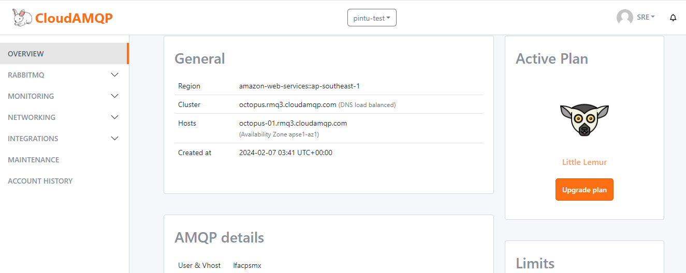
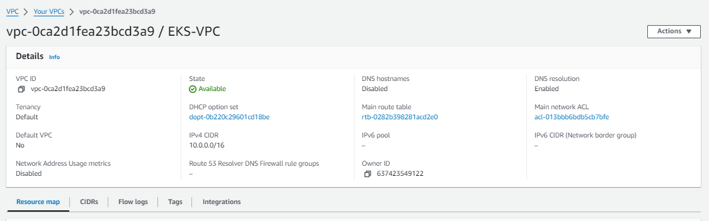
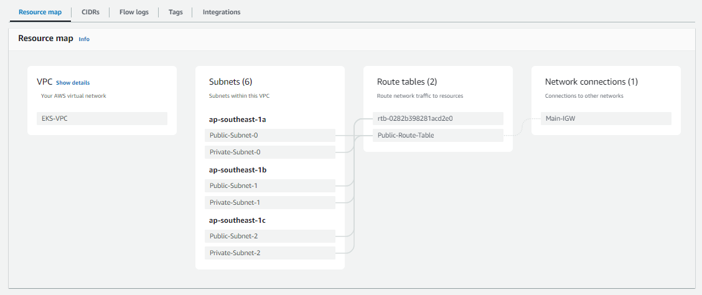
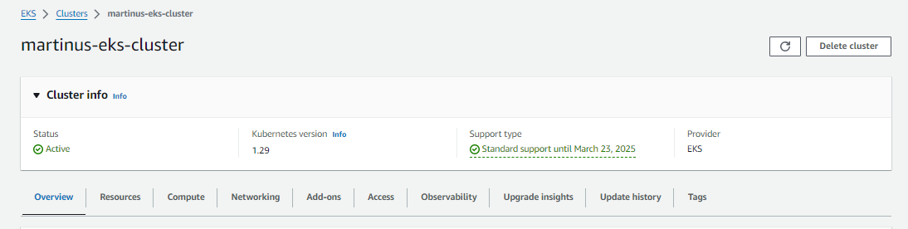
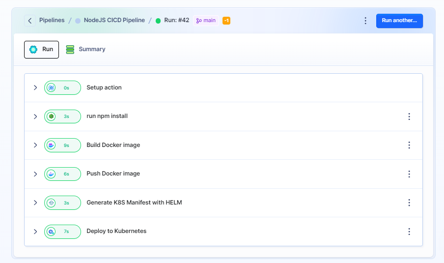

# pintu-infra
Github Project for Technical Assessment

#
# Microservices architecture
`service A => RabbitMQ broker => Service B`

- Service A is written in NodeJS
- Service B is written in Golang

Service is A continuously generating random integer every 5 seconds, and publish it to RabbitMQ broker.
Service B consumes the generated integer from RabbitMQ, and then compute factorial of the integer.

- Service A is publicly accessible from: http://k8s-pintunod-martinus-443ba54739-1459636462.ap-southeast-1.elb.amazonaws.com/messages
- Service B is publicly accessible from: http://k8s-pintugol-martinus-ea50928746-1405819565.ap-southeast-1.elb.amazonaws.com/events

- Docker image used by service A: https://hub.docker.com/r/mar3tin8/pintu-nodejs/tags
- Docker image used by service B: https://hub.docker.com/r/mar3tin8/pintu-golang/tags

#
# Infrastructure Setup
Infrastructure stack used in this project:
- AWS VPC
- EKS Cluster
- RabbitMQ (CloudAMQP platform) https://www.cloudamqp.com/
- Atlantis https://www.runatlantis.io/
- Docker
- Dockerhub https://hub.docker.com/repositories/mar3tin8
- Helm
- Buddy Pipeline

### Atlantis & Terraform
VPC, EKS cluster and RabbitMQ broker was provisioned by Terraform.
Atlantis is utilized to automate terraform plan review. By using `atlantis`, terraform plan can be shared and ease other enginer to review the terraform PR.
Example:
- RabbitMQ provisioning: https://github.com/tampubolon/pintu-infra/pull/1#issuecomment-1931198051

- VPC provisioning: https://github.com/tampubolon/pintu-infra/pull/2#issuecomment-1931319010

- EKS cluster provisioning: https://github.com/tampubolon/pintu-infra/pull/3#issuecomment-1935430398

### Buddy CICD
[Buddy](https://app.buddy.works/test-pintu/app/pipelines/pipeline/483222) is used in this project as the CICD pipeline, the buddy project is publicly accessible. Buddy project URL: https://app.buddy.works/test-pintu/app/pipelines/pipeline/483222. Buddy CICD pipeline is configure by this [yaml file](https://github.com/tampubolon/pintu-infra/blob/main/buddy.yaml)

### Helm
Helm is used to generate the Kubernetes manifest of each service.
- Service A Helm chart: https://github.com/tampubolon/pintu-infra/tree/main/app/service-a/chart
- Service B Helm chart: https://github.com/tampubolon/pintu-infra/tree/main/app/service-b/chart
- Service A Kubernetes manifest: https://github.com/tampubolon/pintu-infra/blob/main/app/service-a/k8s.yaml
- Service B Kubernetes manifest: https://github.com/tampubolon/pintu-infra/tree/main/app/service-b/k8s.yaml